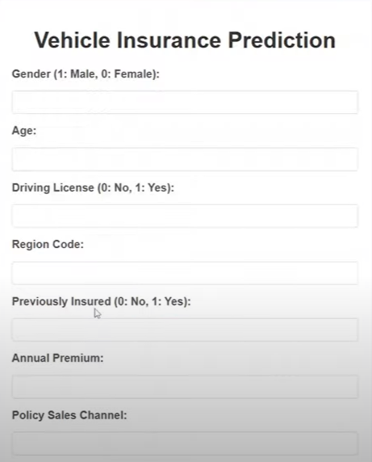
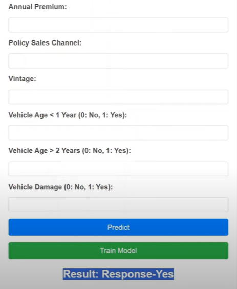

<h1 align="center">🚗 Vehicle Insurance Purchase Prediction System</h1>

  
  
  

---

## 📑 Table of Contents

- [Project Overview](#project-overview)
- [Demo](#demo)
- [Key Features](#key-features)
- [Business Use Case](#business-use-case)
- [Project Architecture](#project-architecture)
- [Model Results](#model-results)
- [Tech Stack](#tech-stack)
- [Project Structure](#project-structure)
- [Quickstart](#quickstart)
- [MongoDB Atlas Setup](#mongodb-atlas-setup)
- [Data & EDA](#data--eda)
- [Model Training & Evaluation](#model-training--evaluation)
- [ML Pipeline Modules](#ml-pipeline-modules)
- [Deployment Workflow](#deployment-workflow)
- [Security](#security)
- [Testing & Maintenance](#testing--maintenance)
- [Model Card](#model-card)
- [Future Work](#future-work)
- [Contributions & Credits](#contributions--credits)
- [License](#license)
- [Contact](#contact)

---

## 📝 Project Overview

A full-stack machine learning web application to predict vehicle insurance purchase intent using customer demographic and behavioral data. This project demonstrates end-to-end ML development, MLOps practices, containerized deployment, cloud integration, and a modular codebase for real-world scalability and maintainability.

**Business Impact:**  
Helps insurers identify high-conversion leads and optimize marketing campaigns.  
**Key Result:**  
Achieved ~87% accuracy with XGBoost on 25,000+ customer records.

---

## 🖼️ Demo

| Filling Details | Prediction Output |
|-----------------|------------------|
|  |  |

---

## 🔹 Key Features

- End-to-end ML pipeline: data ingestion, preprocessing, model training, evaluation, and deployment
- Modular, scalable architecture with MLOps best practices
- MongoDB Atlas integration for cloud data storage
- CI/CD pipeline with GitHub Actions and AWS EC2 deployment
- REST API interface for predictions and retraining
- Visualized EDA and performance metrics
- Dockerized for reproducibility and easy deployment
- MLflow for experiment tracking and model versioning

---

## 🧬 Business Use Case

By predicting whether a customer is likely to purchase insurance, insurers can:
- Prioritize leads with higher conversion potential
- Optimize marketing strategies and reduce acquisition costs
- Improve customer segmentation and personalization

---

## 🏗️ Project Architecture

This project follows a standard ML workflow:

- **Data ingestion** from CSV files
- **Preprocessing & Feature Engineering**
- **Model Training** (XGBoost, Random Forest, Logistic Regression)
- **Model Evaluation & Selection**
- **Model Serialization** (`joblib`)
- **REST API** (Flask) for predictions
- **Dockerized Deployment** (Render/AWS EC2)
- **Data Storage**: MongoDB Atlas

---

## 📊 Model Results

| Model               | Accuracy  | Precision | Recall    | F1 Score  | ROC-AUC |
|---------------------|-----------|-----------|-----------|-----------|---------|
| Logistic Regression | 81.2%     | 79.4%     | 76.1%     | 77.7%     | 0.85    |
| Random Forest       | 85.3%     | 83.0%     | 81.5%     | 82.2%     | 0.88    |
| **XGBoost**         | **87.1%** | **85.7%** | **83.9%** | **84.8%** | **0.90**|

---

## 🛠️ Tech Stack

- **Languages & Frameworks:** Python, Flask, HTML, CSS, Bootstrap
- **ML Libraries:** scikit-learn, XGBoost, pandas, NumPy, Seaborn, Matplotlib
- **Data Storage:** MongoDB Atlas
- **Deployment:** Render, Docker, Gunicorn, AWS EC2, AWS S3
- **CI/CD & MLOps:** Git, GitHub Actions, MLflow

---
<pre>
## 📚 Project Structure
  
vehicle_insurance_predictor/
├── src/ # Core modules (data, model, pipeline)
│ ├── data_ingestion.py
│ ├── data_validation.py
│ ├── data_transformation.py
│ ├── model_trainer.py
│ ├── model_evaluation.py
│ ├── predict.py
│ └── init.py
├── app.py # Flask web app
├── requirements.txt # Python dependencies
├── Dockerfile # Containerization
├── notebook/ # EDA & experiments
│ └── EDA.ipynb
├── static/ # Static web assets
├── templates/ # HTML templates
├── tests/ # Unit tests
├── input.png # Input UI screenshot
├── predict.png # Prediction UI screenshot
└── README.md # Project documentation
 </pre>

**Folder Descriptions:**
- `src/`: Modular code for data pipelines (ingestion, validation, transformation, training, evaluation, prediction)
- `app.py`: Flask application entry point (API + UI)
- `notebook/`: Jupyter notebooks for EDA and prototyping
- `tests/`: Unit tests for core pipeline components
- `static/`, `templates/`: Web frontend assets for Flask
- `input.png`, `predict.png`: UI screenshots used in documentation
- `Dockerfile`, `requirements.txt`: Environment setup for containerized deployment
- `README.md`: Main project documentation
  
## 🚀 Quickstart

1. Clone the repository
git clone https://github.com/Abhi12002/Vehicle-Insurance-Predictor-Project.git
cd Vehicle-Insurance-Predictor-Project

2. Create virtual environment
conda create -n vehicle python=3.10 -y
conda activate vehicle

3. Install dependencies
pip install -r requirements.txt

4. Set environment variables (see .env.example)
5. Train the model
python src/model_trainer.py

6. Start the app
python app.py

text
Access the app at: [http://localhost:5000](http://localhost:5000)

Or run with Docker:
docker build -t vehicle-insurance-predictor .
docker run -p 5000:5000 vehicle-insurance-predictor

text

---

## 📂 MongoDB Atlas Setup

1. Create a free cluster at [MongoDB Atlas](https://www.mongodb.com/cloud/atlas).
2. Add a database user and set IP access to `0.0.0.0/0`.
3. Get the connection string and update your `.env` file.
4. Use the Jupyter notebook in `notebook/` to push the dataset to MongoDB.
5. Verify data upload via MongoDB Compass or Atlas UI.

---

## 📊 Data & EDA

- Dataset: 25,000+ records with features like age, gender, vehicle damage history, policy sales channel, etc.
- EDA performed using Seaborn & Matplotlib to visualize trends (e.g., age vs purchase, region vs response).
- Feature engineering: binned age, one-hot encoding, interaction terms, normalization.
- Outlier detection and handling of missing values.

---

## 🤖 Model Training & Evaluation

- Models: Logistic Regression, Random Forest, XGBoost
- Hyperparameter tuning: GridSearchCV, k-fold cross-validation
- Metrics: Accuracy, Precision, Recall, F1 Score, ROC-AUC
- Experiment tracking and model versioning with MLflow
- Model artifacts saved in the `/artifacts` directory

---

## ⚖️ ML Pipeline Modules

- `data_ingestion.py`: Fetch and preprocess data from MongoDB
- `data_validation.py`: Schema checks, missing values, data consistency
- `data_transformation.py`: Encoding, scaling, feature engineering
- `model_trainer.py`: Model training, hyperparameter tuning, artifact saving
- `model_evaluation.py`: Compare metrics, check for model drift
- `predict.py`: Load model and predict new data
- `app.py`: Flask REST API for inference and retraining

---

## ✨ Deployment Workflow

- **Dockerized app:** `Dockerfile`, `.dockerignore`
- **GitHub Actions:** Automated build, test, and deploy to AWS ECR & EC2
- **Flask + Gunicorn** backend runs on port 5000
- **Cloud deployment:** Render for demo, AWS EC2 for production
- **CI/CD:** All merges to main trigger tests and deployment

---

## 🚨 Security

- HTTPS access through AWS security group configuration
- MongoDB credentials and API keys stored securely in environment variables
- No sensitive data committed to the repo

---

## 🧪 Testing & Maintenance

- Unit tests for data ingestion, transformation, and prediction modules (`tests/` directory)
- To run tests:
pytest tests/

text
- Model drift monitoring and retraining scripts included
- CI/CD pipeline ensures all tests pass before deployment

---

## 📝 Model Card

**Intended Use:**  
Predict insurance purchase intent for lead prioritization by insurers.

**Data:**  
25,000+ customer records with demographic and behavioral features.

**Performance:**  
- XGBoost: 87.1% accuracy, 85.7% precision, 83.9% recall, 0.90 ROC-AUC.

**Limitations:**  
- May not generalize to populations outside the training data.
- Sensitive to data drift; periodic retraining recommended.

**Ethical Considerations:**  
- Ensure model predictions are not used to unfairly discriminate.
- Monitor for bias in input features and outcomes.

---

## 🛣️ Future Work

- Add automated hyperparameter optimization (Optuna, Ray Tune)
- Integrate user authentication for the web app
- Deploy a live demo with monitoring dashboard
- Expand to multi-class or multi-label insurance products
- Add explainability (SHAP, LIME) for model predictions

---

## 🤝 Contributions & Credits

This project was developed by **Abhinav Mishra** as a solo effort, leveraging:
- YouTube tutorials, major ML blogs, and open-source codebases
- Guidance from industry professionals and the global data science community

---

## 📐 License

MIT License

---

## 📬 Contact

**Abhinav Mishra**  
[LinkedIn](https://www.linkedin.com/in/abhinav-mishra-4b72b120b/)  
[GitHub](https://github.com/Abhi12002)

---

## ⭐️ If you found this project useful, please star it!
